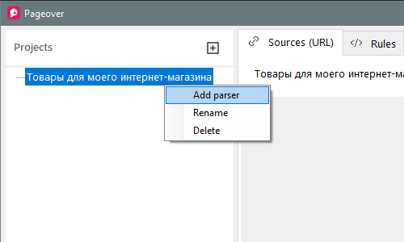

# Парсер

## Добавление парсера к проекту

* Чтобы добавить новый парсер в проект кликните правой копкой мыши по названию проекта в дереве проектов и выберите пункт **Add parser**.

  

* Введите название парсера.

  

_Название парсера не должно содержать специальных символов._

> Вы также можете создать любое количество парсеров.

## Переименование и удаление парсера

* Для переименования парсера необходимо кликнуть правой кнопкой мыши по его названию в дереве проектов **Projects** и выбрать пункт **Rename**.

* Чтобы удалить парсер кликните правой кнопкой мыши по его названию в дереве проектов **Projects** и выберите пункт **Delete**.

> Необходимо учитывать, что при удалении парсера также **удалятся** связанные с ним URL, правила и результаты парсинга.
