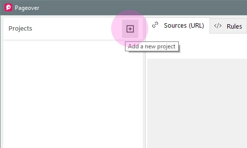
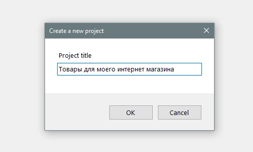

# Проект

## Создание проекта

* В главном окне приложения создайте новый проект, кликнув на знак **+**.

  

* Введите название проекта.

  

  *Название проекта не должно содержать специальных символов.*

> Вы можете создать любое количество проектов.

## Переименование и удаление проекта

* Для переименования проекта необходимо кликнуть правой кнопкой мыши по его названию в дереве проектов **Projects** и выбрать пункт **Rename**.

* Чтобы удалить проект кликните правой кнопкой мыши по его названию в дереве проектов **Projects** и выберите пункт **Delete**.

> Необходимо учитывать, что при удалении проекта удалятся **все** дочерние парсеры.
